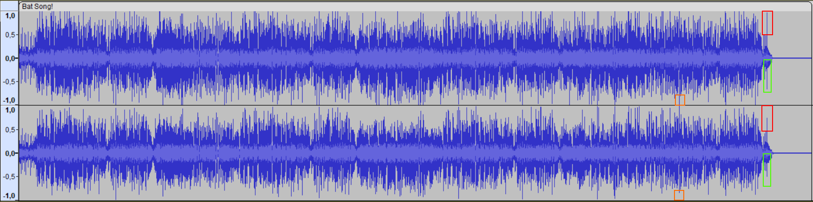

Writeup:
1. Open the given audio ("Bat Song!.wav") in software to analyze audio, e.g., Audacity or Sonic Visualizer
2. Add a spectrogram pane
3. There's no easily visible flag, but by analyzing the waveform, we can notice that the left and right soundtracks slightly differ () which may suggest extra data/hidden flag in one of the flows. Similarly, in spectrogram view, it's possible to notice weird, strangely stronger amplitude between ~11.4 kHz and ~13.5 kHz
4. Splitting the spectrogram view on the left and right channels reveals the flag (approximately at 2:25-2:30) ()