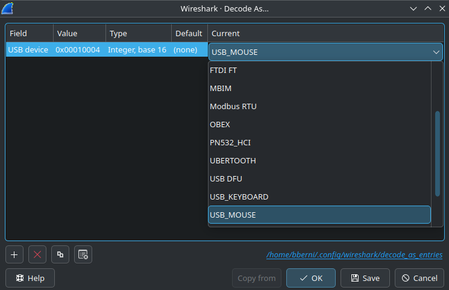
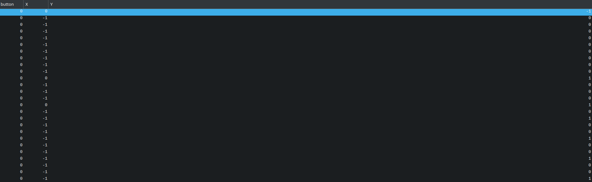
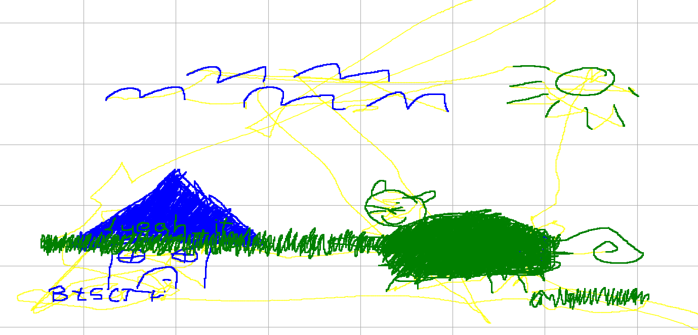
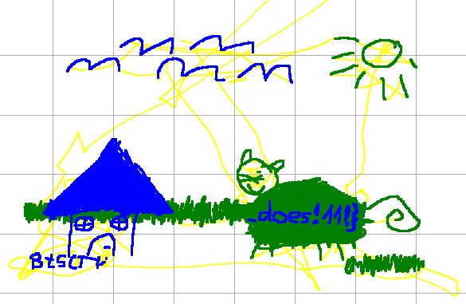

## monkey paint?
It seems like our monkey has got some new special abilities 🐵

## Writeup

After loading the `monkey-paint.pcapng` into Wireshark, you can see that this time there are only USB interrupts, without a HID report that we could use to decode the traffic. Guessing from the challenge name, it could be USB mouse traffic. Fortunately for us, there is a great article on [OSDev wiki](https://wiki.osdev.org/USB_Human_Interface_Devices#USB_mouse) that includes a report format for USB mice.

Based on that I wrote a [Wireshark plugin]() that retrieves relevant data from the capture file. (It also dissects keyboard data, I also used it in the "monkey see" challenge)

I've decoded the traffic using "Decode As" function:

And created the columns so all I see is this:

After extracting dissections to a CSV file, you can find the flag by running this script twice (with swapped zorders for left and right clicks)

```py
import pandas as pd
import matplotlib.pyplot as plt


df = pd.read_csv('<extracted_data.csv>')

df['button'] = pd.to_numeric(df['button'])
df['X'] = pd.to_numeric(df['X'])
df['Y'] = pd.to_numeric(df['Y'])

df['pos_x'] = df['X'].cumsum()
df['pos_y'] = df['Y'].cumsum()

plt.figure(figsize=(8, 6))

for i in range(1, len(df)):
    x_vals = [df['pos_x'].iloc[i-1], df['pos_x'].iloc[i]]
    y_vals = [df['pos_y'].iloc[i-1], df['pos_y'].iloc[i]]
    
    if df['button'].iloc[i] == 1:
        plt.plot(x_vals, y_vals, color='green', linewidth=2, zorder=2)
    elif df['button'].iloc[i] == 2:
        plt.plot(x_vals, y_vals, color='blue', linewidth=2, zorder=3)
    else:
        plt.plot(x_vals, y_vals, color='yellow', linewidth=1, zorder=1)

plt.title('Flag!!!')
plt.xlabel('X Position')
plt.ylabel('Y Position')
plt.grid(True)
plt.gca().invert_yaxis()
plt.show()
```
### Output


### Flag

`BtSCTF{yeah_it_does!11!}`