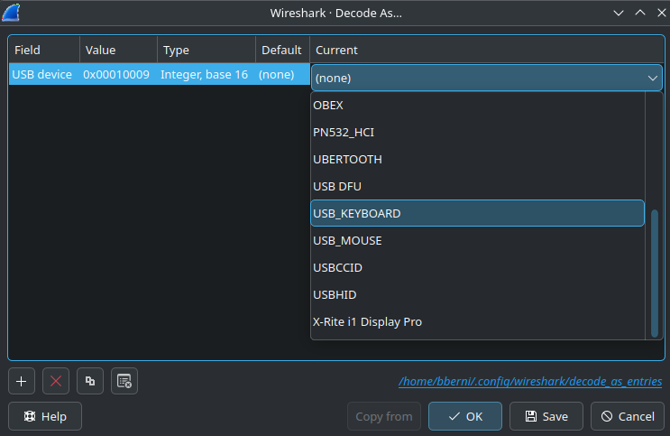
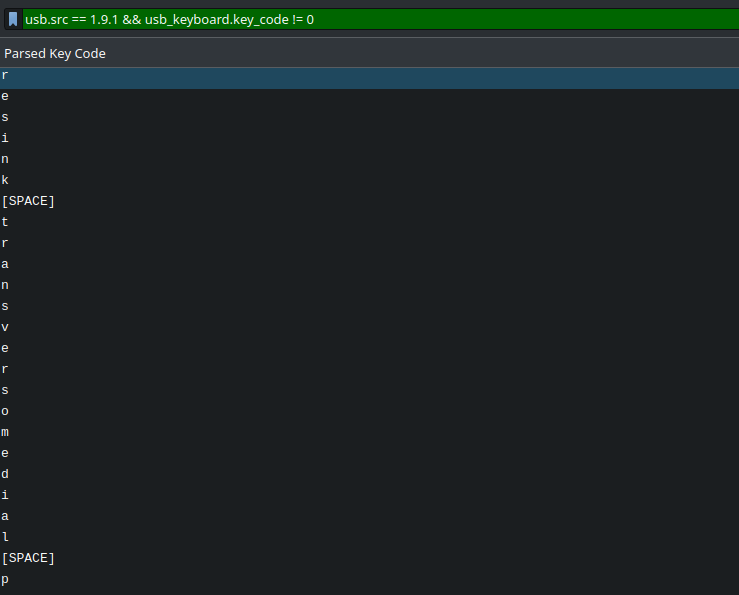

##  monkey see
🙈

## Writeup
#### Author: bberni

### HID report analysis
After opening the monkey-see.pcapng file in Wireshark, it is recognized as USB traffic with lots of interrupts, but also with HID protocol negotiation at the start. Packet 28 is of the most interest there - after dumping and inspecting it with `hid-decode` it returns the following:

```
# device 0:0
# 0x05, 0x01,                    // Usage Page (Generic Desktop)   
# 0x09, 0x06,                    // Usage (Keyboard)             
# 0xa1, 0x01,                    // Collection (Application)        
# 0x85, 0x01,                    //  Report ID (1)                 
# 0x05, 0x07,                    //  Usage Page (Keyboard)         
# 0x19, 0xe0,                    //  Usage Minimum (224)            
# 0x29, 0xe7,                    //  Usage Maximum (231)           
# 0x15, 0x00,                    //  Logical Minimum (0)        
# 0x25, 0x01,                    //  Logical Maximum (1)        
# 0x95, 0x08,                    //  Report Count (8)               
# 0x75, 0x01,                    //  Report Size (1)            
# 0x81, 0x02,                    //  Input (Data,Var,Abs)          
# 0x95, 0x01,                    //  Report Count (1)             
# 0x75, 0x08,                    //  Report Size (8)               
# 0x81, 0x01,                    //  Input (Cnst,Arr,Abs)           
# 0x05, 0x08,                    //  Usage Page (LEDs)             
# 0x19, 0x01,                    //  Usage Minimum (1)              
# 0x29, 0x05,                    //  Usage Maximum (5)              
# 0x95, 0x05,                    //  Report Count (5)                 
# 0x75, 0x01,                    //  Report Size (1)                  
# 0x91, 0x02,                    //  Output (Data,Var,Abs)            
# 0x95, 0x01,                    //  Report Count (1)                  
# 0x75, 0x03,                    //  Report Size (3)                  
# 0x91, 0x01,                    //  Output (Cnst,Arr,Abs)            
# 0x05, 0x07,                    //  Usage Page (Keyboard)          
# 0x19, 0x00,                    //  Usage Minimum (0)                
# 0x2a, 0xff, 0x00,              //  Usage Maximum (255)              
# 0x15, 0x00,                    //  Logical Minimum (0)            
# 0x26, 0xff, 0x00,              //  Logical Maximum (255)            
# 0x95, 0x06,                    //  Report Count (6)                 
# 0x75, 0x08,                    //  Report Size (8)                   
# 0x81, 0x00,                    //  Input (Data,Arr,Abs)               
# 0xc0,                          // End Collection                
...      
```
It also prints data about more functionalities of the device, but we can ignore it - USB interrupt messages only contain the value 0x01 as the first byte. This means that the device uses only the keyboard functionality - first report ID in HID report. We can also ignore Output fields (LEDs) because in our caputer the communication is one-way only.

That leaves us with following message structure:

Byte 0 - Report ID (always 0x01)

Byte 1 - Pressed modifier keys (it is a bitfield directly mapped to values 0xE0-0xE7 in the [HID spec](https://www.usb.org/sites/default/files/hut1_6.pdf))

Byte 2 - padding

Bytes 3-8 - pressed key codes (in our case only byte 3 is used)

Based on that infromation, I wrote a [Wireshark plugin](dissector.lua) that retrieves relevant data from the capture file. (It also dissects mouse data, I also used it in the "monkey paint?" challenge)

### Solving the challenge

After loading the plugin I decoded the traffic as "USB_KEYBOARD"



Then with the following filter and the parsed key column (you need to create it first), we can read the keystrokes.




I used the "Export Packet Dissections as CSV" to write data to a file.

After it cleaning up

```bash
tail -n+2 text.csv | tr -d '\"\n' | sed 's|\[SPACE\]| |g' | sed 's|\[BACKSPACE\]|#|g'
```

And quick python script you have the flag
```py
extracted = "BtSCTF{a#m0ng_us####k3y_t@lks?#####YpE!!1!!1zerozerozero#############oneone!}"
flag = []
for char in extracted:
    if char != "#":
        flag.append(char)
    else:
        flag.pop()
print(''.join(flag))
```
### Flag
`BtSCTF{m0nk3y_tYpE!!1!!oneone!}`