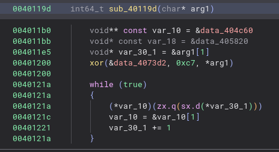

# Solution

The main function only passes the first command line argument, a flag, to the
next one, where the challenge starts.



It decrypts the first function with the first character of the flag,
and then starts functions from subsequent sections. To confuse players, the
names of sections are shuffled by the
`strip` function from the [challenge generator](gen.py).

Encrypted sections are very similar, they contain a function,
a line from "Pan Tadeusz, czyli ostatni zajazd na Litwie" by Adam Mickiewicz,
and some junk data.

The encrypted functions decrypt the section with the next function to be called.
They also loop a random number of times, so that you cannot cheese the
challenge with callgrind.

Every encrypted function is (almost) the same. Also, the first byte of each
section (and function) is the same, i.e., 0x55. To recover the encryption key
(the flag), xor the first byte of each section with 0x55.

```python
from pwn import ELF, xor

elf = ELF("a.out")
enc_sections = (b.data() for b in elf.sections if b.name.startswith("f_"))
print("".join(reversed([chr(xor(section, 0x55)[0]) for section in enc_sections])))
# BtSCTF{D3CRYPT1NG_P4N_T4D3USZ_ON3_X0R_4T_4_T1M3}
```
